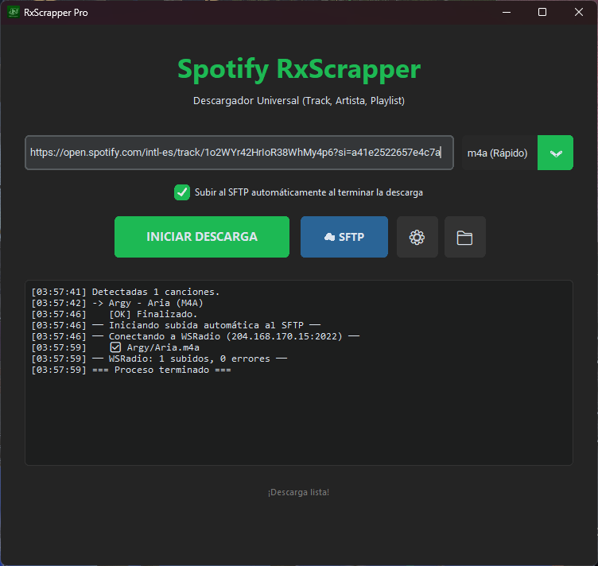
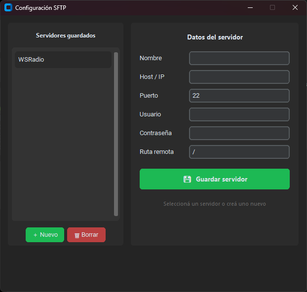

<h1 align="center">
  <br>
  <a href="https://github.com/RXxsk/rxscrapper"></a>
  <br>
  <b>RxScrapper </b>
  <br>
</h1>

<h1 align="center">
  <a href="https://discord.gg/YUm92AEABC">
        
  <a href="https://github.com/Rxxsk/RXscrapper/releases/latest">
        
  <a href="https://rxxsk.github.io/RXScrapper-Page/">
        
        
</h1>

|               Interfaz Principal                  |                     Settings panel SFTP                       |
| :-----------------------------------------------------------: | :--------------------------------------------------------------------------------------------: |
|  |  |

Interfaz Principal RxScrapper Pro Ventana de Configuración SFTP

Flujo de Trabajo con Datos Proceso de Transferencia Finalizada

# Main team

- [**RXx**](https://github.com/RXxsk)
- [**MR**](https://github.com/cristophermr)

# Información General

RxScrapper Pro es una herramienta de escritorio para Windows desarrollada en Python con interfaz gráfica Tkinter, diseñada específicamente para tareas de web scraping y automatización de extracción de datos.

> !IMPORTANT
> Esta es la versión base del scraper. La aplicación incluye una interfaz gráfica completa para facilitar la interacción con el usuario.

Si encuentras problemas o tienes dudas, revisa la sección de Guía de Uso.
Para discutir el desarrollo de RxScrapper Pro, sugerir ideas o pedir ayuda, únete a nuestro servidor de Discord.

# Estado del Proyecto

> [!IMPORTANT]
> RxScrapper Pro se encuentra en su Versión Final Release. La herramienta es totalmente funcional y estable para tareas de scraping.

Actualmente, la aplicación permite realizar scraping de manera eficiente y cuenta con un sistema integrado de configuración SFTP para la transferencia automatizada de los archivos resultantes a servidores remotos.

# Características Principales

· ✅ Interfaz Gráfica Intuitiva: Construida con Tkinter para una experiencia de usuario sencilla y directa.

· ✅ Web Scraping: Funcionalidades para la extracción automatizada de información de la web.

· ✅ Configuración SFTP Integrada: Permite configurar y gestionar conexiones SFTP para la subida de archivos.

· ✅ Optimizado para Windows: Desarrollado y probado en sistemas Windows 10 y superiores.

· ✅ Soporte para Python 3.13+: Construido con la última versión estable de Python.

# Requisitos del Sistema

· Sistema Operativo: Windows 10 o superior (versión 26100+)
· Python: Versión 3.13.0 o superior

Instalación

Clonar el Repositorio

```bash
git clone https://github.com/RXxsk/RXScrapper.git
cd RXScrapper
```

Windows

Sigue las instrucciones de instalación para Windows.


> [!IMPORTANT]
> Los usuarios de macOS necesitan al menos macOS 15.4 para ejecutar RxScrapper Pro correctamente.

# Ejemplos de Uso

> [!IMPORTANT]
> La aplicación cuenta con una interfaz gráfica completa, por lo que no es necesario usar línea de comandos para operaciones básicas.


# Flujo de Trabajo Típico

1. Inicio: La ventana principal "RxScrapper Pro - Final Release" se abrirá.
2. Ingreso de Datos: Utiliza CTRL+A y CTRL+V para seleccionar y pegar información (listas de URLs, etc.).
3. Configuración SFTP:
   · Accede a la ventana "Configuración SFTP".
   · Ingresa los detalles del servidor (host, puerto, usuario, contraseña).
   · Procede a conectar o enviar los archivos.
4. Finalización: Una vez completada la transferencia, cierra la ventana usando el botón "Cerrar".

# 🤝🏻 Cómo Contribuir

Las contribuciones son bienvenidas. Si deseas mejorar RxScrapper, por favor:

1. Haz un fork del proyecto.
2. Crea una nueva rama para tu función (git checkout -b feature/AmazingFeature).
3. Realiza tus cambios y haz commit (git commit -m 'Add some AmazingFeature').
4. Haz push a la rama (git push origin feature/AmazingFeature).
5. Abre un Pull Request.


# Por Qué RXscrapper

Este proyecto nació de la necesidad de tener una herramienta de scraping sencilla pero potente, con interfaz gráfica y capacidades de transferencia de archivos integradas. Dado nuestro tiempo libre limitado, nos enfocamos en crear una herramienta robusta y fácil de usar, con actualizaciones regulares para mejorar su funcionalidad.


